# Day 4-5 catch-up: Delta Lake ACID + time travel evidence

A previously-missed Day 4-5 checklist item, closed as a standalone demo on
`feature/silver-acid-timetravel-demo` (branched off `dev`) rather than
reopening `feature/silver-layer`. Runs against `silver_locations` (13 rows) --
small enough to fully eyeball every row before and after, and isolated from
Bronze, Gold, and the Silver pipeline's actual build logic. The full script
is `src/notebooks/05_silver_acid_timetravel_demo.py`. All screenshots below
are from a real, complete run of that notebook.

## Why a demo table, not a live Silver table Gold depends on

All 5 Silver tables feed Gold's already-built, already-verified materialized
views. Mutating one of them risks Gold's next refresh picking up the demo's
intermediate state and throwing off row counts that are already locked in
and documented (`Dim_Location` 13 rows, `Dim_Street` 36 rows). `silver_locations`
was picked as the target specifically because it's the smallest table (13
rows) and only feeds `Dim_Location` -- no other Gold table depends on it.
Every mutation below is undone before this demo is considered complete (see
Step 6 for how -- `RESTORE TABLE` turned out not to work here, a real
finding in its own right), and no Gold pipeline refresh ran during the
window between the mutations and the rollback.

## Step 1 — Baseline

Row count confirmed against Silver's already-verified number (13), and the
version this baseline corresponds to recorded for later use: **version 27**.

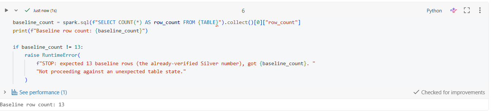

`DESCRIBE HISTORY` before any mutation -- version 27 is the newest entry:

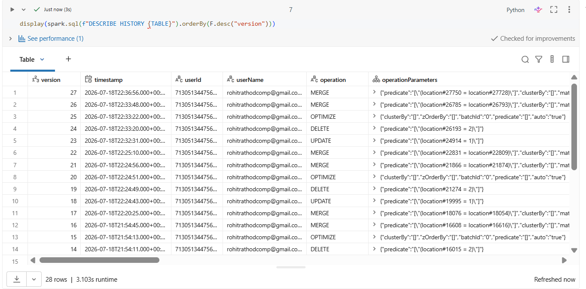

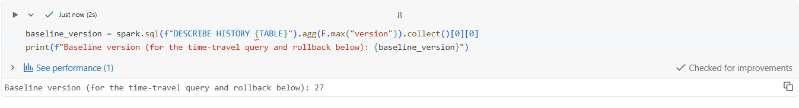

All 13 baseline rows, including the audit columns (`load_dt`/`source_format`/
`source_file`/`run_id`) carried through from the original Bronze ingestion
(`2026-07-13`, `node_locations.csv`) -- confirms the Silver audit-passthrough
fix from `fix/audit-column-passthrough` is intact:

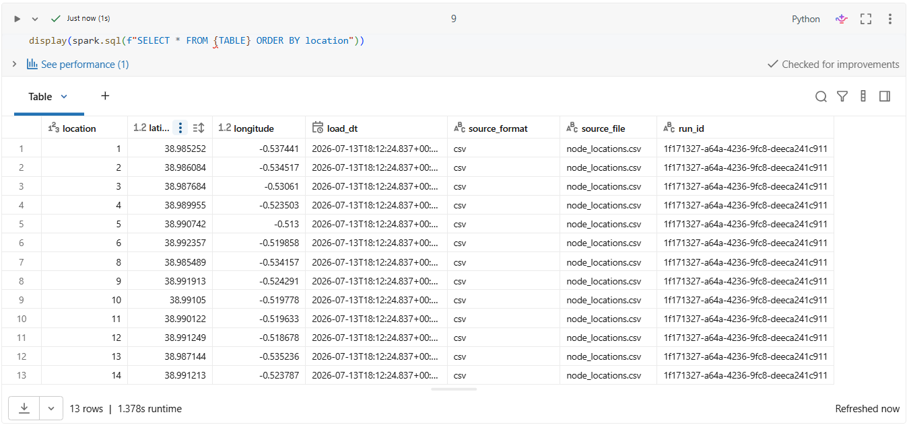

## Step 2 — UPDATE (atomicity/consistency)

`location=1`'s coordinates updated by +1.0/+1.0 -- an obviously different,
clearly marked test value.

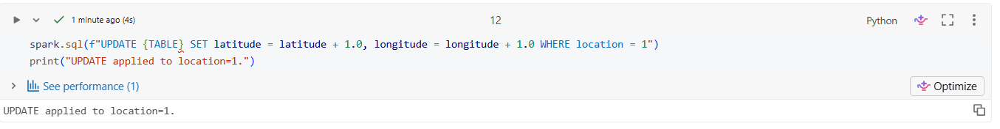

New history entry: **version 28**, operation `UPDATE`.

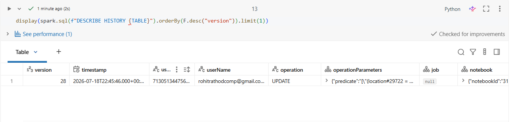

`location=1` after the update -- latitude `39.985252` (was `38.985252`),
longitude `0.4625590000000005` (was `-0.537441`), exactly +1.0 on both:

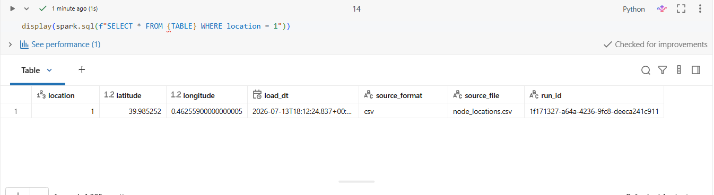

## Step 3 — DELETE (atomicity/consistency)

`location=2` deleted (a different row from the one just updated).

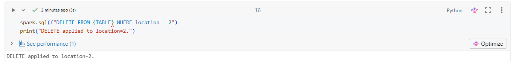

New history entry: **version 29**, operation `DELETE`.

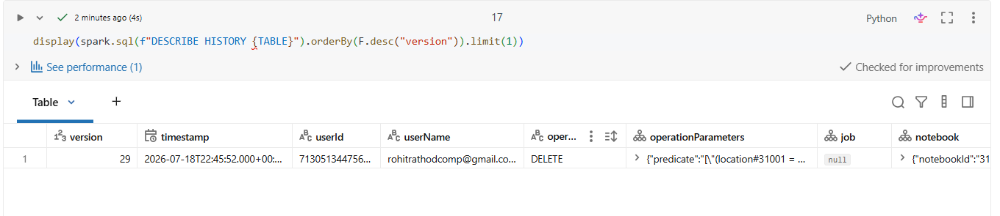

## Step 4 — MERGE (atomicity/consistency)

One inline source row matched `location=3` (existing) and updated just its
latitude; one inline source row's `location=99` didn't exist and was
inserted as a new row -- a single `MERGE` statement doing both an update and
an insert as one atomic transaction.

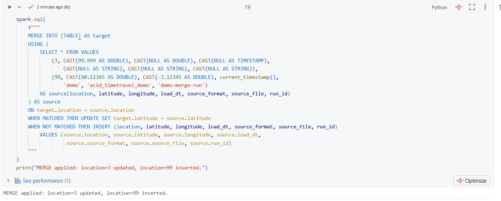

New history entry: **version 31** (version 30 was an automatic `OPTIMIZE`
compaction, not a demo step -- Databricks' auto-optimize ran on its own
between the DELETE and this MERGE).

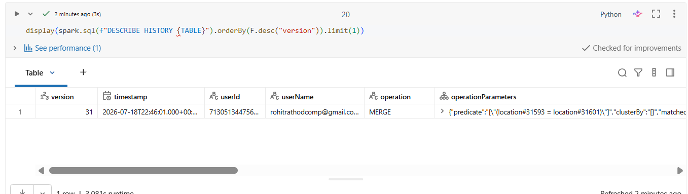

`location=3`/`location=99` after the merge -- `location=3`'s latitude is now
`99.999` (an obviously-marked test value, longitude unchanged at
`-0.53061`), and `location=99` exists with `source_format="demo"`,
`run_id="demo-merge-run"`:

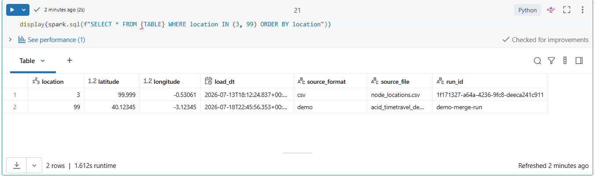

## Step 5 — Time travel: querying the pre-demo version

Even though the *current* table (at this point) has location=2 deleted and
locations 1/3 changed, `SELECT * FROM silver_locations VERSION AS OF 27`
shows the original data exactly as it was before any of this notebook ran --
all 13 original rows, the deleted row (location=2) still visible, and the
updated/merged rows (location=1, location=3) still showing their original
values, in that historical view:

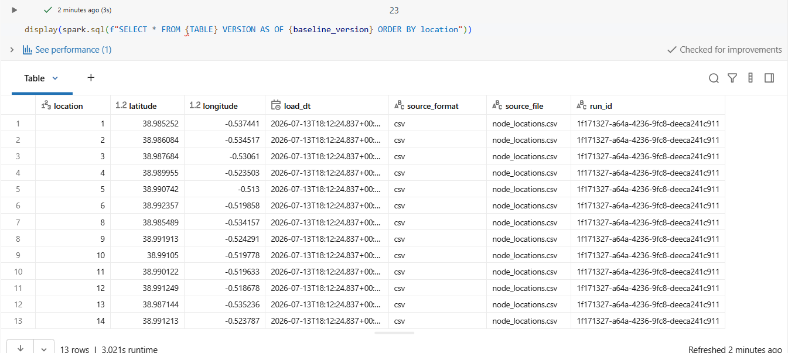

## Step 6 — Durability/rollback (via time travel)

A `MERGE` using the baseline version (read via `VERSION AS OF 27` -- time
travel) as its source, reconciling the current table back to that exact
point in time in one atomic statement:

```sql
MERGE INTO silver_locations AS target
USING (SELECT * FROM silver_locations VERSION AS OF 27) AS source
ON target.location = source.location
WHEN MATCHED THEN UPDATE SET *              -- reverts location=1, location=3
WHEN NOT MATCHED THEN INSERT *               -- re-inserts location=2 (deleted)
WHEN NOT MATCHED BY SOURCE THEN DELETE       -- removes location=99 (merge-inserted)
```

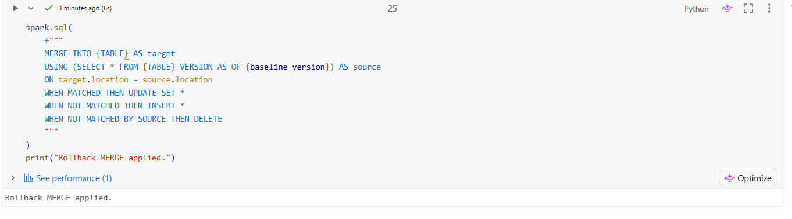

`RESTORE TABLE` is the more direct way to do this on a plain Delta table,
but isn't used here -- it's **not supported on Delta Live Tables-managed
streaming tables**, and `silver_locations` is one. This is a real,
confirmed limitation (hit directly while building this demo -- an earlier
run failed with `The operation RESTORE is not allowed: The operation is not
supported on Streaming Tables`, and had to be fixed by hand with exactly
the `MERGE` above), not a hypothetical caveat. The `MERGE` is still entirely
powered by time travel: without `VERSION AS OF` being queryable, there would
be no source to reconcile against at all.

(One real snag hit while building this: Databricks requires `WHEN NOT
MATCHED BY SOURCE` clauses to come *after* `WHEN MATCHED`/`WHEN NOT MATCHED`
clauses in a `MERGE` -- placing it first is a genuine parse error,
`[PARSE_SYNTAX_ERROR] Syntax error at or near 'THEN'`.)

## Step 7 — Final verification

Final row count: **13** (the `if final_count != 13: raise` check passed
silently -- no error means the count matched). Full table, all 13 rows
matching the original baseline exactly (location=2 back at `38.986084`/
`-0.534517`, location=1 back at `38.985252`/`-0.537441`, location=3 back at
`38.987684`/`-0.53061`, no location=99):

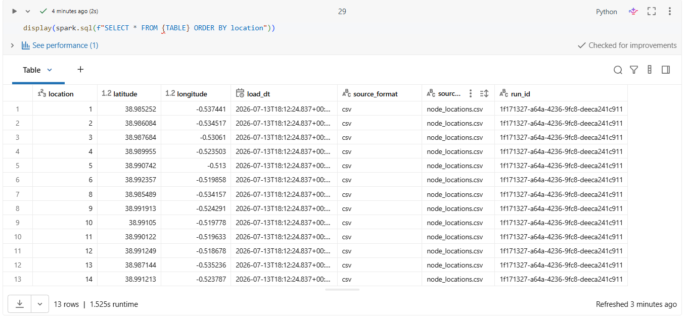

Spot-checks on the 3 rows this notebook actually touched, not just the
total count:

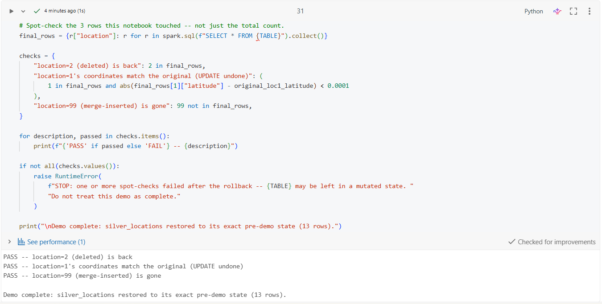

```
PASS -- location=2 (deleted) is back
PASS -- location=1's coordinates match the original (UPDATE undone)
PASS -- location=99 (merge-inserted) is gone

Demo complete: silver_locations restored to its exact pre-demo state (13 rows).
```

**Gold impact: none.** No Gold pipeline refresh ran between the Step 2
mutation and the Step 6 rollback, so `Dim_Location` (built from
`silver_locations`) never saw the intermediate mutated state. `Dim_Location`'s
row count remains 13, unaffected, exactly as already documented in
`docs/gold_data_model.md`.

## What this demonstrates

Every write to a Delta table -- whether an `UPDATE`, `DELETE`, or `MERGE` --
is one atomic, versioned transaction: it either fully applies or doesn't
apply at all, and it's recorded as a new, immutable entry in the table's
history (ACID). Older versions remain fully queryable via `VERSION AS
OF`/`TIMESTAMP AS OF` even after later writes have changed the "current"
view of the table -- the data isn't gone, just superseded. `RESTORE TABLE`
is Delta's built-in tool for turning that history into point-in-time
rollback, but it doesn't apply universally -- it's not supported on Delta
Live Tables-managed streaming tables, a real limitation hit and confirmed
while building this demo, not a hypothetical caveat. The underlying
capability (durable history + queryable old versions) still delivers the
same rollback guarantee even there: a `MERGE` sourced from a `VERSION AS
OF` read reconciles a table back to an exact prior state just as
completely as `RESTORE` would, and that rollback is itself just another
tracked transaction, not a special, unaudited operation. All of
the above is backed by the real version numbers, operation metrics, and
query output captured above, not just a description of the feature.
