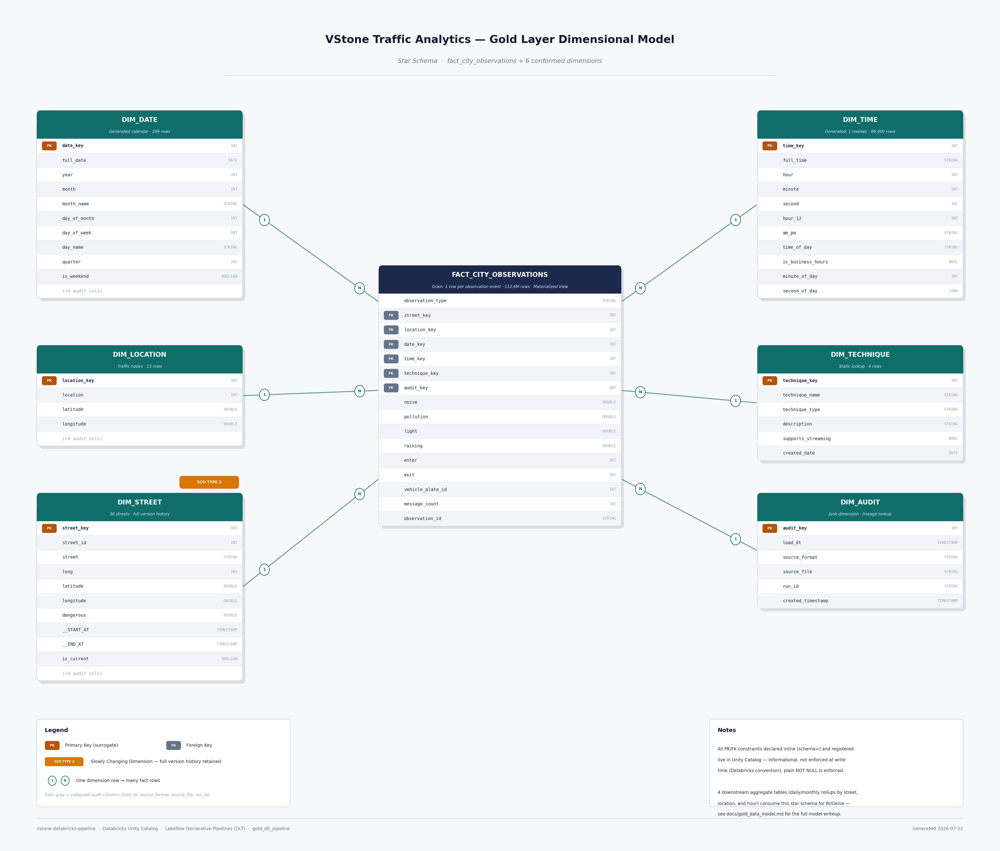

# Gold data model — dimensions, one unified fact, and PK/FK relationships

## Star schema overview

```
Dim_Date ──────────┐
Dim_Location ───────┤                                ┌── agg_daily_street_conditions
Dim_Street ─────────┼──< Fact_City_Observations >────┼── agg_daily_location_traffic
Dim_Technique ──────┤                                ├── agg_monthly_street_summary
Dim_Audit ──────────┘                                └── agg_hourly_telegram_activity
```

Full ERD, with every column, PK/FK, and cardinality:



One fact table, not several — `fact_city_observations` uses an
`observation_type` discriminator (`'environmental'` / `'traffic'` /
`'telegram'`) to carry all three measurement domains at one row-per-event
grain, instead of one fact table per domain. Each branch populates only its
own measures and leaves the others `NULL`.

## Tables and surrogate keys

| Table | Type | Surrogate key (PK) | Natural key | Notes |
|---|---|---|---|---|
| `dim_date` | Materialized view | `date_key` (int, `YYYYMMDD`) | `full_date` | Generated, no source file |
| `dim_location` | Materialized view | `location_key` (int) | `location` | 13 rows — `location=7` excluded (bad coordinates, rejected at Silver) |
| `stg_dim_street_scd2` | Streaming table | — (internal CDC plumbing, not a public dimension) | `street_id` | `AUTO CDC FROM SNAPSHOT` target |
| `dim_street` | Materialized view | `street_key` (int) | `street_id` + `__START_AT` | SCD2 — full version history, `is_current` flag, 36 streets |
| `dim_technique` | Materialized view | `technique_key` (int) | `technique_name` | Static, 4 rows — `autoloader`/`copyinto`/`dlt`/`pyspark`, the real techniques used anywhere in this pipeline (matches `pipelines.silver.traffic.SOURCE_TECHNIQUES` exactly) |
| `dim_audit` | Materialized view | `audit_key` (int) | `(load_dt, source_format, source_file, run_id)` | Junk dimension consolidating lineage metadata — 6 distinct combinations on the real dataset |
| `dim_time` | Materialized view | `time_key` (int, `HHMMSS`) | `(hour, minute, second)` | Generated, one row per second of day — 86,400 rows |
| `fact_city_observations` | Materialized view | — (grain is `observation_type` + the fact-side natural key) | — | 112,586,955 rows (87,776,721 environmental + 24,681,794 traffic + 128,440 telegram) |
| `agg_daily_street_conditions` | Materialized view | `(street_key, date_key)` | — | One row per street per day, environmental branch only |
| `agg_daily_location_traffic` | Materialized view | — (`location_key` nullable, see orphan below) | — | One row per location per day, traffic branch only |
| `agg_monthly_street_summary` | Materialized view | `(street_key, year, month)` | — | One row per street per month, environmental branch only |
| `agg_hourly_telegram_activity` | Materialized view | `(date_key, hour)` | — | One row per date per hour, telegram branch only |

## SCD2 scope — why only `dim_street` is SCD2

The project brief's Day 6.A checklist says "all dimensions must be
implemented as SCD2." In this model, only `dim_street` actually is —
`dim_location`, `dim_date`, `dim_time`, `dim_technique`, and `dim_audit` are
Type-1/static. That's a deliberate scope decision, not an oversight, made
against each dimension's actual source data:

- **`dim_location`** — 13 fixed traffic-node coordinates. A location's
  latitude/longitude changing would mean the physical intersection moved,
  which doesn't happen; any observed change would be a one-off data-quality
  fix, not a business event worth a version history.
- **`dim_date` / `dim_time`** — generated calendars (one row per real day /
  per second of day), not sourced from any file. There is no "previous
  version" of a calendar date to track — the row for `2024-01-02` never
  changes once written.
- **`dim_technique`** — a static, hardcoded 4-row lookup
  (`autoloader`/`copyinto`/`dlt`/`pyspark`). The set of ingestion techniques
  used by this pipeline doesn't change without a code change, at which point
  the lookup itself gets edited directly.
- **`dim_audit`** — a junk dimension of ETL lineage metadata
  (`load_dt`/`source_format`/`source_file`/`run_id`). Each row already
  represents one immutable, point-in-time ingestion event; there's no
  "attribute changing on the same key" for SCD2 to version, since a new load
  is a brand new row, not an update to an old one.

`dim_street`, by contrast, has real source attributes (`street` name,
`dangerous` rating, `long`, `latitude`, `longitude`) that plausibly change
for the same `street_id` over time — a street gets renamed, its danger
rating gets re-assessed — which is exactly the case SCD2 exists for. All 5
tracked attributes are versioned (`TRACKED_COLUMNS` in `dim_street.py`), not
just the 2 the dimensional-model analysis rated "high priority"
(`street`, `dangerous`) — kept simple rather than picking and choosing which
attributes get history.

## Fact/dimension categorization

Facts hold foreign keys, additive measures, and degenerate identifiers.
Dimensions hold descriptive/classifying attributes — including numeric ones
(`dim_time.hour`, `dim_street.dangerous`) that are never aggregated, only
filtered/grouped on or resolved to the version active at a point in time.

- **`fact_city_observations`** measures: `noise`, `pollution`, `light`,
  `raining` (environmental); `enter`, `exit` (traffic); `message_count`
  (telegram). FKs: `street_key`, `location_key`, `date_key`,
  `time_key`, `technique_key`, `audit_key`. `observation_type` is a
  degenerate discriminator (a tiny 3-value tag, not normalized into its own
  dimension — a deliberate simplicity trade-off); `observation_id` is a
  degenerate dimension (identifier, no attributes of its own);
  `vehicle_plate_id` (traffic-only, `NULL` elsewhere) is a degenerate
  dimension carried straight from `silver_traffic.id` (Kaggle: "car plate
  without numbers", 0-998) — not broken out into its own `dim_vehicle` since
  the source has no other vehicle attributes to hang off it, just enough to
  support `COUNT(DISTINCT vehicle_plate_id)`-style per-vehicle analysis.
  `message_length` was deliberately dropped (was `LENGTH(message)`) — no
  aggregation of message length has business value; recompute from
  `silver_telegram.message` directly if ever needed.
- **`dim_technique.technique_key`** replaces what used to be a raw
  `source_technique STRING` sitting directly in a fact table — `enter`/`exit`
  rows resolve their real, per-row-varying technique via a join on
  `traffic.source_technique == dim_technique.technique_name`; environmental
  and telegram rows resolve to the single `"copyinto"` technique (verified:
  both real Bronze sources behind them use `copy_into`), via a `crossJoin`
  against a one-row lookup rather than a per-row equi-join.
- **`dim_audit.audit_key`** replaces the 4 raw audit columns
  (`load_dt`/`source_format`/`source_file`/`run_id`) that used to sit
  directly on every fact/dimension row with a single FK.

## Audit column lineage — two patterns, by design

- **`dim_date`, `dim_location`, `dim_street`** carry the standard 4 audit
  columns, selected straight through from their Silver source (or, for
  `dim_date`, stamped fresh as `source_format="generated"` since there's no
  Bronze file behind a calendar).
- **`dim_technique` and `dim_time`** carry **no** audit columns at all —
  both are pure generated/static reference tables with nothing meaningful to
  stamp (no source file, no per-row lineage), one step further than
  `dim_date`'s "generated" exception.
- **`fact_city_observations`** carries lineage via `audit_key` (an FK into
  `dim_audit`), not raw columns — this is the one place lineage is
  normalized rather than duplicated per row.
- **All 4 `agg_*` tables** keep their own raw audit columns stamped fresh as
  `source_format="generated"` — each is a `GROUP BY` aggregate over millions
  of rows, so there's no single row's lineage to carry through, same
  reasoning as any aggregate table in this project.

## Foreign keys (intended relationships)

| From | Column | To | Column |
|---|---|---|---|
| `fact_city_observations` | `street_key` | `dim_street` | `street_key` |
| `fact_city_observations` | `location_key` | `dim_location` | `location_key` |
| `fact_city_observations` | `date_key` | `dim_date` | `date_key` |
| `fact_city_observations` | `time_key` | `dim_time` | `time_key` |
| `fact_city_observations` | `technique_key` | `dim_technique` | `technique_key` |
| `fact_city_observations` | `audit_key` | `dim_audit` | `audit_key` |
| `agg_daily_street_conditions` | `street_key` | `dim_street` | `street_key` |
| `agg_daily_street_conditions` | `date_key` | `dim_date` | `date_key` |
| `agg_daily_location_traffic` | `location_key` | `dim_location` | `location_key` |
| `agg_daily_location_traffic` | `date_key` | `dim_date` | `date_key` |
| `agg_monthly_street_summary` | `street_key` | `dim_street` | `street_key` |
| `agg_hourly_telegram_activity` | `date_key` | `dim_date` | `date_key` |

`agg_monthly_street_summary`'s `(year, month)` has no FK target — `dim_date`'s
grain is one row per day, so there's no single `dim_date` row a `(year,
month)` pair could reference. `agg_hourly_telegram_activity`'s `hour` has no
FK to `dim_time` for the same reason: `hour` isn't `dim_time`'s `PRIMARY KEY`
(`time_key` is), so a `FOREIGN KEY` there wouldn't be a real relationship.

`date_key`/`time_key`/`technique_key`/`audit_key` are declared `NOT NULL` on
`fact_city_observations`. **Caveat on that "0 NULLs" claim:** it was true but
misleading for `time_key` before the fix documented below — the column was
never `NULL`, it was hardcoded to `0` for every traffic/environmental row, so
the NOT NULL check passed while the FK pointed at the wrong `dim_time` row
(midnight) for ~99.9% of the fact table. Needs a fresh full-refresh and
re-verification (row counts, NULL checks, `time_key` distribution) before any
of the counts on this page can be trusted post-fix.

## Known, expected orphan: `location_key`

Traffic rows for `location=7` (2,373,327 of 24,681,794 traffic rows) have a
`NULL` `location_key` — `location=7`'s coordinates were quarantined at
Silver (`silver_locations_rejected`), so it's correctly excluded from
`dim_location`, but its sensor readings still exist as a real, separate
domain. `agg_daily_location_traffic` surfaces this as a `NULL`-keyed group
per date (rather than silently dropping it) by filtering to
`observation_type == 'traffic'` first and left-joining to `dim_location`,
same pattern the table it replaced (`gold_location_summary`) originally set.

## Business aggregates

Four aggregate tables, each filtered to one `observation_type` first (not to
incidentally-null columns) and each at its own grain — replaces an earlier,
coarser pair (`gold_daily_summary`: city-wide per day; `gold_location_summary`:
per location, all-time) with views that actually support trend analysis per
street/location and the brief's Day 6.B "monthly trend" ask:

- **`agg_daily_street_conditions`** — one row per `(street_key, date_key)`,
  `observation_type == 'environmental'` only. `avg`/`max`/`min` for `noise`,
  `pollution`, `light`; `rain_intensity_sum`; `observation_count`. Answers
  "how do conditions on this street trend day to day."
  `rain_intensity_sum` sums `raining` only where it's `>= 0` (replacing
  negatives with `0` first) — `raining`'s source range is `-1` to `99.99`,
  where `-1` is a sentinel meaning "not raining" (confirmed: ~49% of raw
  values), not a real reading. Summing the column directly would let every
  "not raining" row silently subtract from the total. Named
  `rain_intensity_sum`, not `hours_raining`: `raining` is a percentage-style
  reading (sum of cars / street length), not a duration, so summing readings
  isn't literally "hours."
- **`agg_daily_location_traffic`** — one row per `(location_key, date_key)`,
  `observation_type == 'traffic'` only. `total_enter`/`total_exit`,
  `net_traffic`, `avg`/`max` `enter`/`exit`, `observation_count`. Answers
  "how does traffic at this intersection trend day to day." Surfaces the
  `location=7` orphan as its own `NULL`-keyed group per date rather than
  dropping it (see "Known, expected orphan" above).
- **`agg_monthly_street_summary`** — one row per `(street_key, year, month)`,
  `observation_type == 'environmental'` only. `avg`/`max` for `noise`,
  `pollution`, `light`; `days_with_rain`; `observation_count`;
  `observation_days`. Answers the brief's "monthly trend" ask, long-term/
  seasonal view. `days_with_rain` is `COUNT(DISTINCT date_key WHERE raining
  > 0)`, **not** `SUM(raining > 0)` — at street+month grain there can be
  thousands of readings per day, so counting raw readings instead of
  distinct days would wildly overstate "days" (one rainy day with 500
  readings would read as "500 days of rain").
- **`agg_hourly_telegram_activity`** — one row per `(date_key, hour)`,
  `observation_type == 'telegram'` only. `total_messages`,
  `observation_count`. Answers "when do most incident reports come in" — now
  meaningful, since `fact_city_observations.time_key` is a real per-row
  extraction rather than the hardcoded `0` it used to be for
  traffic/environmental rows (see "Real bugs caught and fixed" below;
  telegram's `time_key` was always correct, this table just wasn't very
  interesting to build before the fix). No `avg`/`max`/`min` message-length
  measures — `message_length` was dropped from `fact_city_observations`
  entirely (no business value in aggregating it).

Every Gold table (dimensions, fact, and all 4 aggregates) lives in the one
`gold_dlt_pipeline` DLT pipeline, run via `gold_job`.

## Constraint enforcement — real, registered UC constraints

Lakeflow Declarative Pipelines accepts `PRIMARY KEY`/`FOREIGN KEY`
constraints declared inline in the `schema=` argument of `@dlt.table`, at
the moment the table is created — see `src/pipelines/gold/table_schemas.py`
for every table's full column schema plus constraints. Confirmed live via
`information_schema.table_constraints`/`key_column_usage`: every constraint
is really registered, and `information_schema.tables.table_type` still
reports `MATERIALIZED_VIEW` throughout. Databricks documents UC PK/FK as
**informational only** (not enforced like an RDBMS constraint at write
time) — these exist for catalog lineage/documentation/BI-tool discovery,
not to reject bad writes. Plain column-level `NOT NULL` (distinct from
PK/FK) **is** enforced at write time by Delta — confirmed live when
`dim_technique.technique_key`'s inferred `LongType` was rejected against
its declared `INT NOT NULL`.

`agg_daily_location_traffic` has no `PRIMARY KEY`: its grain includes
`location_key`, but `location_key` is legitimately `NULL` for the orphan
group above — a `PRIMARY KEY` member can't be `NULL`. Its `FOREIGN KEY` is
unaffected, since FK columns are allowed to be `NULL`. The other 3 `agg_*`
tables declare composite `PRIMARY KEY`s over their full grain (e.g.
`(street_key, date_key)`), the same DDL path DLT accepts for the
single-column PKs elsewhere in this model.

## Real bugs caught and fixed while building this model

- **Timestamp/date join mismatch**: joining `environment.date`/`traffic.date`
  (TIMESTAMP, real time-of-day) directly against `dim_date.full_date`
  (DATE) without `F.to_date()` silently resolved `date_key` to `NULL` for
  almost every real row. Fixed by casting to `DATE` before the join.
- **Hardcoded `technique_key`**: originally stamped as a constant for every
  traffic row, discarding the real per-row variation across all 4
  ingestion techniques. Fixed with a real join on `source_technique`.
- **Hardcoded `time_key` on traffic/environmental branches**: both stamped
  `F.lit(0)` for every row instead of extracting the real time-of-day from
  `traffic.date`/`env.date` — silently defaulting ~99.9% of the fact table
  (everything except telegram) to midnight and making `dim_time` useless for
  intraday analysis (peak hour, rush hour, time-of-day patterns) despite the
  FK passing its `NOT NULL` check. Fixed with a shared `_time_key_expr()`
  helper reusing the telegram branch's already-correct HHMMSS extraction
  (`hour*10000 + minute*100 + second`, matching `dim_time.time_key`'s
  format) — **not** seconds-since-midnight, which would still not match
  `dim_time` and would silently orphan the FK instead of fixing it.
- **`Int`/`Long` schema mismatch**: `spark.createDataFrame()` infers
  Python int literals as `LongType`, but `dim_technique.technique_key` is
  declared `INT` — Delta rejected the write (`DELTA_MERGE_INCOMPATIBLE_DATATYPE`)
  until the column was explicitly cast.
- **Eager `.collect()` breaking DLT flow resolution**: an early version of
  the technique lookup called `.collect()` to resolve a scalar, which forced
  execution during DLT's graph-analysis pass — before `dim_technique` (a
  sibling table in the *same* pipeline run) had actually been computed.
  Fixed by keeping the lookup fully lazy (a `crossJoin` against a one-row
  DataFrame, resolved at real execution time in the correct dependency
  order) rather than collecting a Python scalar.
- **Unqualified column after `withColumn()` on an aliased DataFrame**:
  `telegram_df.alias("telegram").withColumn("time_key", ...)` — the new
  `time_key` column doesn't carry the `"telegram"` alias, so
  `F.col("telegram.time_key")` failed to resolve. Fixed by referencing the
  column unqualified.

All verified full-refreshed and re-verified live in `vstone_traffic_dev`.
